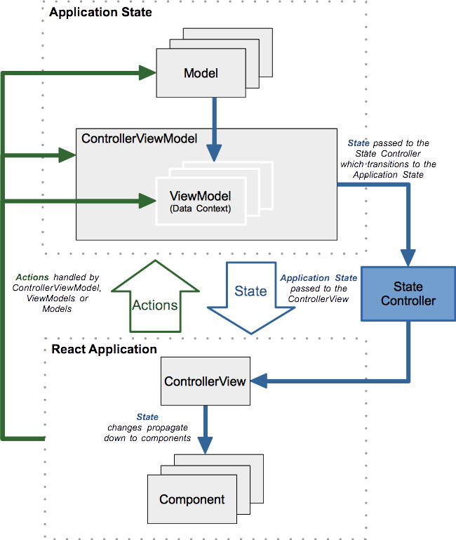

IMVVM
=====

IMVVM helps implement the Model-View-ViewModel pattern in [React](http://facebook.github.io/react/) applications. It's role is to provide the framework to create Models and ViewModels, with React acting as the View. It is designed to complement React. The IMVVM API gets its inspiration from the React library. So it feels like React. This makes it easy to understand and enables you to be productive in a short time frame.

#####Documentation: https://github.com/entrendipity/imvvm/wiki

#####Example Applications: https://github.com/entrendipity/IMVVM.example

## TL;DR: Fast Forward >>

### IMVVM Application Flows



### TodoMVC example code
#### Create Model
```javascript
var TodoClass = IMVVM.createModelClass({

  getInitialState: function(){
    return {
      id: this.id || Date.now().toString(),
      complete: false
    };
  },

  id: {
    get: function(){
      return this.state.id;
    }
  },
  
  text: {
    get: function(){
      return this.state.text;
    },
    set: function(newVal){
      this.setState({text: newVal});
    }
  },

  complete: {
    get: function(){
      return this.state.complete;
    },
    set: function(newVal){
      this.setState({complete: newVal});
    }
  }

});
```

#### Create ViewModel
```javascript
var todoStateChangeHandler = function(state){
  var nextState = {todos:{}};
  nextState.selectedTodo = void(0);
  nextState.todos[state.id] = new Todo(this.todos[state.id], state);
  nextState.todos = IMVVM.extend(this.todos, nextState.todos);
  this.setState(nextState);
};

var Todo = function(){
  return new TodoClass(todoStateChangeHandler).apply(this, arguments);
};

var TodoViewModel = IMVVM.createViewModel({
  
  getInitialState: function(){
    return { todos: {} };
  },

  todos: {
    get: function(){
      return this.state.todos;
    }
  },

  areAllComplete: {
    get: function(){    
      var _todos = this.todos;
      for (id in _todos) {
        if (!_todos[id].complete) {
          return false;
          break;
        }
      }
      return true;
    }
  },

  selectedTodo: {
    kind: 'instance',
    get: function(){
      return this.state.selectedTodo;
    }
  },

  create: function(text) {
    
    var todo = new Todo({
      text: text
    }, true);

    var nextTodos = IMVVM.extend(this.todos);
    nextTodos[todo.id] = todo;    
    this.setState({todos: IMVVM.extend(this.todos, nextTodos)});
  },

  selectToEdit: function(id) {
    var nextState = {};
    nextState.selectedTodo = new Todo(this.todos[id]);
    nextState.todos = IMVVM.extend(this.todos);
    nextState.todos[id] = nextState.selectedTodo;
    this.setState(nextState);
  },

  toggleComplete: function(todo) {
    var nextTodos = {};
    nextTodos[todo.id] = new Todo(todo, {complete: !todo.complete});
    nextTodos = IMVVM.extend(this.todos, nextTodos);
    this.setState({todos: nextTodos});
  },

  toggleCompleteAll: function() {
    var nextTodos = {};
    var allComplete = this.areAllComplete;
    for(var key in this.todos){
      if(this.todos.hasOwnProperty(key)){
        if(allComplete){
          nextTodos[key] = new Todo(this.todos[key], {complete: false});
        } else  if(!this.todos[key].complete){
          nextTodos[key] = new Todo(this.todos[key], {complete: true});
        }
      } 
    }
    nextTodos = IMVVM.extend(this.todos, nextTodos);
    this.setState({todos: nextTodos});
  },

  destroy: function(id) {
    var nextTodos = {};
    for(var key in this.todos){
      if(this.todos.hasOwnProperty(key) && key !== id){
        nextTodos[key] = this.todos[key];
      }
    }
    this.setState({todos: nextTodos});
  },

  destroyCompleted: function() {
    var nextTodos = {};
    for(var key in this.todos){
      if(this.todos.hasOwnProperty(key) && !this.todos[key].complete){
        nextTodos[key] = new Todo(this.todos[key]);
      } 
    }
    this.setState({todos: nextTodos});
  }

});
```

#### Create DomainViewModel
```javascript
var TodoControllerViewModel = IMVVM.createControllerViewModelClass({
  /**
  * Expose the TodoViewModel to the "Controller-View" as `Todos` Data Context.
  * This will be attached to this.state.dataContext
  */
  Todos: {
    viewModel: TodoViewModel,
    get: function(){
      return this.state.Todos;
    }
  }
});
```

#### Hook up the View (Controller-View)
```javascript
var TodoApp = React.createClass({
  /**
  * Mixin sets up Event handler for 'change' events coming from
  * TodoControllerViewModel data context
  */
  mixins: [IMVVM.mixin.main],

  render: function() {
    var todosDataContext = this.state.dataContext.Todos;
    return (
      <div>
        <Header todosDataContext={todosDataContext}/>
        <MainSection
          allTodos={todosDataContext.todos}
          areAllComplete={todosDataContext.areAllComplete}
          todosDataContext={todosDataContext}
        />
        <Footer todosDataContext={todosDataContext} allTodos={todosDataContext.todos} />
      </div>
    );
  },
});
```

#### React Components Interact with DomainDataContext
```javascript
var MainSection = React.createClass({

  propTypes: {
    allTodos: ReactPropTypes.object.isRequired,
    areAllComplete: ReactPropTypes.bool.isRequired
  },

  render: function() {
    var dataContext = this.props.todosDataContext;

    if (Object.keys(dataContext.todos).length < 1) {
      return null;
    }
    
    var allTodos = this.props.allTodos;
    var areAllComplete = this.props.areAllComplete;
    var todos = [];

    for (var key in allTodos) {
      todos.push(<TodoItem key={key} 
        todosDataContext={dataContext} 
        todo={allTodos[key]} />);
    }

    return (
      <section id="main">
        <input
          id="toggle-all"
          type="checkbox"
          onChange={this._onToggleCompleteAll}
          checked={areAllComplete ? 'checked' : ''}
        />
        <label htmlFor="toggle-all">Mark all as complete</label>
        <ul id="todo-list">{todos}</ul>
      </section>
    );
  },

  _onToggleCompleteAll: function() {
    this.props.todosDataContext.toggleCompleteAll();
  }

});

var Header = React.createClass({
  render: function() {
    return (
      <header id="header">
        <h1>todos</h1>
        <TodoTextInput
          id="new-todo"
          placeholder="What needs to be done?"
          onSave={this._onSave}
        />
      </header>
    );
  },

  _onSave: function(text) {
    if (text.trim()){
      this.props.todosDataContext.create(text);
    }
  }
});

var Footer = React.createClass({

  propTypes: {
    allTodos: ReactPropTypes.object.isRequired
  },

  render: function() {
    var allTodos = this.props.allTodos;
    var total = Object.keys(allTodos).length;

    if (total === 0) {
      return <noscript />;
    }

    var completed = 0;
    for (var key in allTodos) {
      if (allTodos[key].complete) {
        completed++;
      }
    }

    var itemsLeft = total - completed;
    var itemsLeftPhrase = itemsLeft === 1 ? ' item ' : ' items ';
    itemsLeftPhrase += 'left';

    var clearCompletedButton;
    if (completed) {
      clearCompletedButton =
        <button
          id="clear-completed"
          onClick={this._onClearCompletedClick}>
          Clear completed ({completed})
        </button>;
    }

    return (
      <footer id="footer">
        <span id="todo-count">
          <strong>
            {itemsLeft}
          </strong>
          {itemsLeftPhrase}
        </span>
        {clearCompletedButton}
      </footer>
    );
  },

  _onClearCompletedClick: function() {
    this.props.todosDataContext.destroyCompleted();
  }
});

var TodoItem = React.createClass({

  propTypes: {
   todo: ReactPropTypes.object.isRequired
  },

  getInitialState: function() {
    return {
      isEditing: false
    };
  },

  render: function() {

    var todo = this.props.todo;

    var input;
    if (this.state.isEditing) {
      input =
        <TodoTextInput
          className="edit"
          onSave={this._onSave}
          value={todo.text}
        />;
    }

    return (
      <li
        className={cx({
          'completed': todo.complete,
          'editing': this.state.isEditing
        })}
        key={todo.id}>
        <div className="view">
          <input
            className="toggle"
            type="checkbox"
            checked={todo.complete}
            onChange={this._onToggleComplete}
          />
          <label onDoubleClick={this._onDoubleClick}>
            {todo.text}
          </label>
          <button className="destroy" onClick={this._onDestroyClick} />
        </div>
        {input}
      </li>
    );
  },

  _onToggleComplete: function() {
    this.props.todosDataContext.toggleComplete(this.props.todo);
  },

  _onDoubleClick: function() {
    this.props.todosDataContext.selectToEdit(this.props.todo.id);
    this.setState({isEditing: true});
  },

  _onSave: function(text) {
    this.props.todosDataContext.selectedTodo.text = text;
    this.setState({isEditing: false});
  },

  _onDestroyClick: function() {
    this.props.todosDataContext.destroy(this.props.todo.id);
  }
});
```

#### Start the Application
```javascript
/* Use controllerViewModel prop to reference the TodoControllerViewModel */
React.renderComponent(
  <TodoApp controllerViewModel={TodoControllerViewModel}/>,
  document.getElementById('todoapp')
);
```

## Author
Frank Panetta  - [Follow @fattenap](https://twitter.com/intent/follow?screen_name=fattenap)

##License
###The MIT License (MIT)

Copyright (c) 2014 Entrendipity

Permission is hereby granted, free of charge, to any person obtaining a copy of this software and associated documentation files (the "Software"), to deal in the Software without restriction, including without limitation the rights to use, copy, modify, merge, publish, distribute, sublicense, and/or sell copies of the Software, and to permit persons to whom the Software is furnished to do so, subject to the following conditions:

The above copyright notice and this permission notice shall be included in all copies or substantial portions of the Software.

THE SOFTWARE IS PROVIDED "AS IS", WITHOUT WARRANTY OF ANY KIND, EXPRESS OR IMPLIED, INCLUDING BUT NOT LIMITED TO THE WARRANTIES OF MERCHANTABILITY, FITNESS FOR A PARTICULAR PURPOSE AND NONINFRINGEMENT. IN NO EVENT SHALL THE AUTHORS OR COPYRIGHT HOLDERS BE LIABLE FOR ANY CLAIM, DAMAGES OR OTHER LIABILITY, WHETHER IN AN ACTION OF CONTRACT, TORT OR OTHERWISE, ARISING FROM, OUT OF OR IN CONNECTION WITH THE SOFTWARE OR THE USE OR OTHER DEALINGS IN THE SOFTWARE.
